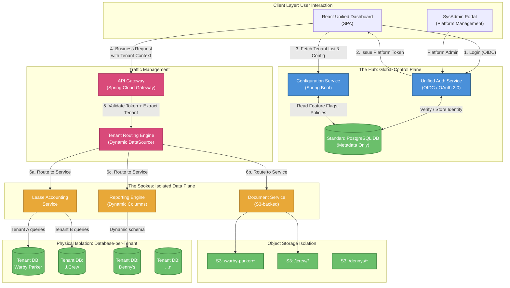

---

## 1. Executive Summary

ASG Edge Plus (codename **Lucy**) is a multi-tenant SaaS platform designed to replace a fragmented ecosystem of single-tenant installations with a unified **Hub & Spoke** architecture. The platform decouples **Global Identity** from **Local Authorization**, eliminating the "21-Login Problem" where a single operator (e.g., a SysAdmin at ASG) must maintain separate credentials across every client environment.

The architecture enforces **physical data isolation** (database-per-tenant) while centralizing identity, configuration, and routing through a shared Standard Layer. This design satisfies SOC 2 Type II and SOX compliance requirements mandated by Big Four auditors without sacrificing operational efficiency.

---

## 2. Architecture Overview

### 2.1 The Hub & Spoke Model

The system is divided into two planes:

| Plane | Layer | Responsibility | Data Sensitivity |
|-------|-------|---------------|-----------------|
| **Control Plane** (Hub) | Standard Layer | Identity, Configuration, Routing, Feature Flags | Metadata only — no business data |
| **Data Plane** (Spokes) | Tenant Layer | Business logic, Lease accounting, Documents, Reports | Client PII, financial data, audit trails |

The Hub never stores or processes business data. It only holds the metadata required to authenticate users, resolve tenant context, and route requests to the correct Spoke.

### 2.2 High-Level Architecture Diagram

---

## 3. The Problem: Pain Points Driving This Architecture

### 3.1 The "21-Login Problem"

In the current state, each client environment (Warby Parker, J.Crew, Denny's, etc.) is a **standalone deployment** with its own authentication system. An ASG operator servicing 21 clients must maintain 21 separate sets of credentials, 21 browser sessions, and context-switch between entirely different URLs.

**Impact:**
- Credential fatigue leads to password reuse and weak passwords
- No unified audit trail across client environments
- Onboarding a new ASG employee requires provisioning access in every client system individually
- No centralized view of which employees have access to which clients

### 3.2 Configuration Drift

Each standalone deployment diverges over time. Client-specific customizations (extra report columns, custom workflows, modified field labels) are implemented as code forks or environment-specific branches. This makes upgrades and patch management extremely expensive.

### 3.3 Audit Complexity

SOC 2 and SOX auditors require evidence that:
- User access is appropriately scoped per client
- Segregation of Duties (SoD) is enforced
- A complete audit trail exists for every data mutation

With 21 separate systems, producing this evidence requires extracting and correlating logs from each environment independently — a process that is error-prone and time-consuming.

### 3.4 Tenant Data Contamination Risk

In a naive multi-tenant system (shared database, row-level isolation), a single vulnerability or application logic error can expose one client's financial data to another client. For a lease accounting platform handling rent rolls, CAM reconciliations, and financial reporting, this is an unacceptable risk.

---

## 4. Tech Stack

| Layer | Technology | Justification |
|-------|-----------|---------------|
| **Frontend** | React (SPA) + TypeScript | Component-based UI; dynamic rendering driven by Config Service JSON schemas |
| **API Gateway** | Spring Cloud Gateway | Native integration with Spring ecosystem; token validation, rate limiting, tenant header injection |
| **Backend Services** | Spring Boot 3.x (Java 17+) | Mature ecosystem for enterprise services; built-in multi-tenant data routing support |
| **Authentication** | OIDC / OAuth 2.0 (Keycloak or AWS Cognito) | Standards-based SSO; supports MFA, federation, and token exchange |
| **Standard Database** | PostgreSQL 15+ | Metadata store for tenant registry, global users, config, and RBAC mappings |
| **Tenant Databases** | PostgreSQL 15+ (one instance per tenant) | Physical isolation; each tenant gets a dedicated database |
| **Object Storage** | AWS S3 (prefix-per-tenant) | Document storage with IAM-scoped access policies per tenant |
| **Message Broker** | Apache Kafka or AWS SQS | Asynchronous event processing (audit log ingestion, report generation) |
| **Caching** | Redis | Session store, tenant config caching, rate limiting counters |
| **Infrastructure** | AWS (ECS/EKS or EC2) | Containerized deployment; horizontal scaling of stateless services |
| **CI/CD** | GitHub Actions / Jenkins | Automated build, test, and deployment pipelines |
| **Monitoring** | Prometheus + Grafana / AWS CloudWatch | Metrics, alerting, tenant-level resource tracking |