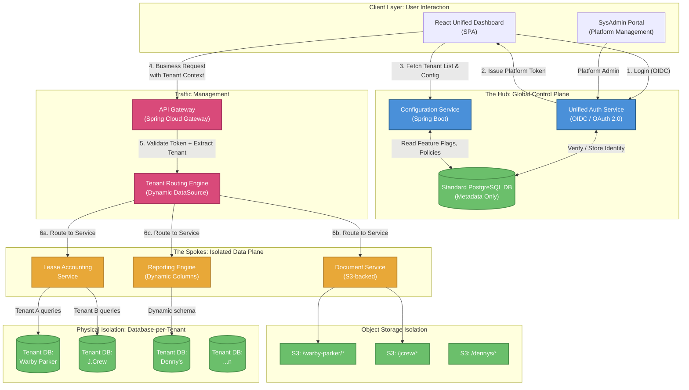

# ASG Edge Plus (Lucy): Technical Architecture Document

---

## 1. Executive Summary

ASG Edge Plus (codename **Lucy**) is a multi-tenant SaaS platform designed to replace a fragmented ecosystem of single-tenant installations with a unified **Hub & Spoke** architecture. The platform decouples **Global Identity** from **Local Authorization**, eliminating the "21-Login Problem" where a single operator (e.g., a SysAdmin at ASG) must maintain separate credentials across every client environment.

The architecture enforces **physical data isolation** (database-per-tenant) while centralizing identity, configuration, and routing through a shared Standard Layer. This design satisfies SOC 2 Type II and SOX compliance requirements mandated by Big Four auditors without sacrificing operational efficiency.

---

## 2. Architecture Overview

### 2.1 The Hub & Spoke Model

The system is divided into two planes:

| Plane | Layer | Responsibility | Data Sensitivity |
|-------|-------|---------------|-----------------|
| **Control Plane** (Hub) | Standard Layer | Identity, Configuration, Routing, Feature Flags | Metadata only — no business data |
| **Data Plane** (Spokes) | Tenant Layer | Business logic, Lease accounting, Documents, Reports | Client PII, financial data, audit trails |

The Hub never stores or processes business data. It only holds the metadata required to authenticate users, resolve tenant context, and route requests to the correct Spoke.

### 2.2 High-Level Architecture Diagram



---

## 3. The Problem: Pain Points Driving This Architecture

### 3.1 The "21-Login Problem"

In the current state, each client environment (Warby Parker, J.Crew, Denny's, etc.) is a **standalone deployment** with its own authentication system. An ASG operator servicing 21 clients must maintain 21 separate sets of credentials, 21 browser sessions, and context-switch between entirely different URLs.

**Impact:**
- Credential fatigue leads to password reuse and weak passwords
- No unified audit trail across client environments
- Onboarding a new ASG employee requires provisioning access in every client system individually
- No centralized view of which employees have access to which clients

### 3.2 Configuration Drift

Each standalone deployment diverges over time. Client-specific customizations (extra report columns, custom workflows, modified field labels) are implemented as code forks or environment-specific branches. This makes upgrades and patch management extremely expensive.

### 3.3 Audit Complexity

SOC 2 and SOX auditors require evidence that:
- User access is appropriately scoped per client
- Segregation of Duties (SoD) is enforced
- A complete audit trail exists for every data mutation

With 21 separate systems, producing this evidence requires extracting and correlating logs from each environment independently — a process that is error-prone and time-consuming.

### 3.4 Tenant Data Contamination Risk

In a naive multi-tenant system (shared database, row-level isolation), a single vulnerability or application logic error can expose one client's financial data to another client. For a lease accounting platform handling rent rolls, CAM reconciliations, and financial reporting, this is an unacceptable risk.

---

## 4. Tech Stack

| Layer | Technology | Justification |
|-------|-----------|---------------|
| **Frontend** | React (SPA) + TypeScript | Component-based UI; dynamic rendering driven by Config Service JSON schemas |
| **API Gateway** | Spring Cloud Gateway | Native integration with Spring ecosystem; token validation, rate limiting, tenant header injection |
| **Backend Services** | Spring Boot 3.x (Java 17+) | Mature ecosystem for enterprise services; built-in multi-tenant data routing support |
| **Authentication** | OIDC / OAuth 2.0 (Keycloak or AWS Cognito) | Standards-based SSO; supports MFA, federation, and token exchange |
| **Standard Database** | PostgreSQL 15+ | Metadata store for tenant registry, global users, config, and RBAC mappings |
| **Tenant Databases** | PostgreSQL 15+ (one instance per tenant) | Physical isolation; each tenant gets a dedicated database |
| **Object Storage** | AWS S3 (prefix-per-tenant) | Document storage with IAM-scoped access policies per tenant |
| **Message Broker** | Apache Kafka or AWS SQS | Asynchronous event processing (audit log ingestion, report generation) |
| **Caching** | Redis | Session store, tenant config caching, rate limiting counters |
| **Infrastructure** | AWS (ECS/EKS or EC2) | Containerized deployment; horizontal scaling of stateless services |
| **CI/CD** | GitHub Actions / Jenkins | Automated build, test, and deployment pipelines |
| **Monitoring** | Prometheus + Grafana / AWS CloudWatch | Metrics, alerting, tenant-level resource tracking |

### Why These Choices Matter

**Dynamic Tenant Data Routing** — The backend framework (Spring Boot) natively supports a pattern where a single deployed service can switch its database connection dynamically based on which tenant's request it is processing. The tenant identifier arrives via the API Gateway, and the service resolves the correct database connection at runtime. This means we deploy **one set of services**, not one per tenant.

**Schema-Driven Frontend** — The React frontend does not hardcode client-specific screens. Instead, it fetches UI schema definitions from the Configuration Service and renders components dynamically. This means adding a 32nd column to Denny's Rent Roll report is a **configuration change**, not a code deployment.

---

## 5. Multi-Tenancy Architecture: Deep Dive

### 5.1 Isolation Strategy: Database-per-Tenant

We employ the strictest form of multi-tenant isolation: **each tenant gets a physically separate database**.

| Strategy | Isolation Level | Complexity | Compliance Fit |
|----------|---------------|------------|---------------|
| Row-level (shared DB, shared schema) | Low | Low | Insufficient for SOC 2 / SOX |
| Schema-per-Tenant (shared DB, separate schemas) | Medium | Medium | Acceptable with additional controls |
| **Database-per-Tenant** | **High** | **High** | **Preferred — full physical isolation** |

**Why database-per-tenant is non-negotiable for this use case:**

1. **Blast radius containment**: A vulnerability in one tenant's context physically cannot access another tenant's tables. The database connection itself is scoped to a single tenant.
2. **Clean data handoff**: When a client churns, we export their entire database. No scrubbing, no row filtering, no risk of data leakage.
3. **Per-tenant backup/restore**: Each tenant's database has its own backup schedule and point-in-time recovery capability.
4. **Auditor simplicity**: When a SOC 2 auditor asks "prove that Warby Parker's data is isolated from J.Crew's data," the answer is: "They are in physically separate databases with separate credentials."

### 5.2 How Tenant Isolation Works

The following diagram illustrates how a single request flows from the user's browser to the correct tenant database, with no possibility of cross-tenant data access:

```
┌──────────────┐
│   User's     │    "Show me Warby Parker's leases"
│   Browser    │
└──────┬───────┘
       │  Request carries Tenant Token
       │  (scoped to Warby Parker)
       ▼
┌──────────────┐
│  API Gateway │    Validates token, extracts tenant_id = "t_001"
│              │    Sets internal header: X-Tenant-ID: t_001
└──────┬───────┘
       │
       ▼
┌──────────────┐
│  Tenant      │    Reads X-Tenant-ID header
│  Routing     │    Looks up connection for "t_001"
│  Engine      │    Resolves → Warby Parker's database
└──────┬───────┘
       │  Connection points to ONE database only
       ▼
┌──────────────┐
│  Lease       │    Executes query using the resolved connection
│  Service     │    Query hits Warby Parker's DB — and ONLY that DB
└──────┬───────┘
       │
       ▼
┌──────────────┐
│  Warby       │    ✓ Data returned
│  Parker DB   │    ✗ J.Crew DB is unreachable from this connection
└──────────────┘    ✗ Denny's DB is unreachable from this connection
```

**Key guarantee**: There is no "super connection" that can reach multiple tenant databases from application code. The routing engine resolves to exactly one database, and that resolution is the isolation boundary.

### 5.3 Connection Pool Management

Each tenant's database connection is managed via a dedicated connection pool:

- **Lazy initialization**: Connection pools are created on first request, not at startup. This avoids holding idle connections to tenants that haven't been accessed.
- **Per-tenant pool sizing**: Each tenant gets a bounded pool (e.g., max 10 connections), preventing a single busy tenant from exhausting the connection budget.
- **Eviction**: Idle pools are evicted after a configurable timeout (e.g., 30 minutes of inactivity) to free resources.

### 5.4 Cross-Tenant Query Prevention

The architecture makes cross-tenant queries **structurally impossible**, not just policy-prohibited:

1. The routing engine resolves to a connection that physically points to only one database.
2. There is no "super connection" that can reach multiple tenant databases from application code.
3. The Standard DB (metadata) and Tenant DBs (business data) are on separate database instances.
4. Service code never constructs queries with tenant identifiers — the connection itself is the isolation boundary.

---

## 6. Identity & Access Management: Dual-Layer RBAC

### 6.1 The Problem with Flat RBAC

A flat RBAC model (one set of roles per user) cannot express: "Dawn is a Lease Controller for Warby Parker but a Read-Only Auditor for J.Crew." A single role assignment would either over-privilege or under-privilege her across tenants.

### 6.2 Dual-Layer RBAC Model

We solve this with two distinct role layers:

#### Layer 1: Platform Roles (Global Scope)

These roles govern access to the **platform itself** (the Hub).

| Role | Capabilities |
|------|-------------|
| Platform Super Admin | Create/delete tenants, manage global users, view platform dashboard, configure global policies |
| Platform Admin | Manage user-tenant assignments, view platform health metrics |
| Platform User | Authenticate, view assigned tenant cards, switch tenant context |

#### Layer 2: Tenant Roles (Scoped to a Single Tenant)

These roles govern access to **business functionality within a specific tenant**.

| Role | Capabilities | Data Access |
|------|-------------|-------------|
| Tenant Admin | Manage users within this tenant, configure tenant-specific settings | Full read/write |
| Lease Controller | Approve monetary transactions, generate rent files, manage payment batches | Read/write on financial data |
| Lease Analyst | Create/edit lease abstracts, upload documents, run standard reports | Read/write on lease & document data |
| Auditor | View all data, export reports, review audit logs | Read-only |
| Report Viewer | Access dashboards and pre-built reports only | Read-only on reporting views |

### 6.3 How the Mapping Works

The Standard Database maintains a central mapping that links each **Global User** to one or more **Tenants**, each with a specific **Role**. This is the core data structure that powers the entire RBAC system:

```
┌───────────────────────────────────────────────────────────────────┐
│                     Standard Database (Hub)                        │
│                                                                   │
│  Global User: Dawn (dawn@asg.com)                                │
│  Platform Role: Platform User                                     │
│                                                                   │
│  ┌─────────────────────────────────────────────────────────────┐  │
│  │  Tenant Assignments                                         │  │
│  │                                                             │  │
│  │  ┌─────────────┐  ┌─────────────┐  ┌─────────────┐        │  │
│  │  │ Warby Parker │  │ J.Crew      │  │ Denny's     │        │  │
│  │  │             │  │             │  │             │        │  │
│  │  │ Role: Lease │  │ Role:       │  │ Role: Lease │        │  │
│  │  │ Controller  │  │ Auditor     │  │ Analyst     │        │  │
│  │  │             │  │ (Read-Only) │  │             │        │  │
│  │  │ Granted by: │  │ Granted by: │  │ Granted by: │        │  │
│  │  │ Admin Smith │  │ Admin Jones │  │ Admin Lee   │        │  │
│  │  │             │  │             │  │             │        │  │
│  │  │ Expires:    │  │ Expires:    │  │ Expires:    │        │  │
│  │  │ Never       │  │ Mar 2026    │  │ Never       │        │  │
│  │  └─────────────┘  └─────────────┘  └─────────────┘        │  │
│  └─────────────────────────────────────────────────────────────┘  │
│                                                                   │
└───────────────────────────────────────────────────────────────────┘
```

Notice that Dawn has **different roles in different tenants**, and her J.Crew access is **time-bound** (expires March 2026) — a common pattern for external audit engagements.

### 6.4 Segregation of Duties (SoD) Enforcement

The Configuration Service maintains a **conflict matrix** per tenant that prevents toxic role combinations. Two types of conflicts exist:

| Conflict Type | Behavior | Example |
|--------------|----------|---------|
| **HARD** | System rejects the role assignment entirely | A Lease Creator cannot also be a Payment Approver (SOX requirement: the person who creates an obligation cannot approve payment against it) |
| **SOFT** | System allows assignment but requires explicit approval from a Platform Super Admin and generates an audit event | A Tenant Admin should not also hold the Auditor role (best practice: admin should not self-audit) |

This conflict matrix is evaluated every time a role assignment is created or modified. Hard conflicts are enforced as system-level blocks; soft conflicts require documented justification and approval.

### 6.5 Greatest Common Denominator (GCD) Policy

When a user is assigned to multiple tenants, the platform computes the **most restrictive** security posture across all active tenant policies:

```
User: dawn@asg.com
  Tenant A (Warby Parker): password rotation = 90 days,  MFA = required,  session timeout = 30 min
  Tenant B (J.Crew):       password rotation = 60 days,  MFA = required,  session timeout = 15 min

GCD Policy Applied to Dawn:
  password rotation = min(90, 60)  → 60 days
  MFA              = required       → enforced (any tenant requires it → global enforcement)
  session timeout  = min(30, 15)   → 15 minutes
```

This ensures the user's authentication posture satisfies the strictest client requirement without per-session policy switching. Dawn's password must rotate every 60 days and her session times out after 15 minutes — even when she's working in the Warby Parker context — because J.Crew's stricter policy pulls the floor up.

---

## 7. Authentication Architecture

### 7.1 Two-Token Architecture

The system uses **OIDC / OAuth 2.0** with a **two-token model**:

| Token | Issued When | Scope | Lifetime | Contains |
|-------|-------------|-------|----------|----------|
| **Platform Token** | At login | Standard Layer (Hub) | 2 hours | User ID, email, platform role, list of assigned tenant IDs |
| **Tenant Token** | On tenant context switch | Single tenant (Spoke) | 15 minutes | Tenant ID, tenant role, granular permissions |

**Why two tokens?**
- The Platform Token only lists which tenants the user can access — it does not contain roles. If intercepted, an attacker cannot determine what the user can do inside any tenant.
- The Tenant Token is short-lived (15 minutes) to minimize the window of a compromised token. The frontend silently refreshes it in the background.
- Permissions are embedded in the Tenant Token so that the API Gateway can enforce access on every request without a database lookup.

### 7.2 Authentication Flow

```
┌──────────┐       ┌──────────────┐       ┌────────────┐       ┌──────────────┐
│  Browser  │       │  Auth Service │       │ Standard DB │       │  API Gateway  │
│  (React)  │       │  (Keycloak)   │       │ (Postgres)  │       │              │
└─────┬─────┘       └──────┬───────┘       └──────┬─────┘       └──────┬───────┘
      │                     │                      │                     │
      │  1. User enters     │                      │                     │
      │  email + password   │                      │                     │
      │────────────────────>│                      │                     │
      │                     │  2. Validate creds   │                     │
      │                     │─────────────────────>│                     │
      │                     │  3. Check MFA status │                     │
      │                     │<─────────────────────│                     │
      │  4. MFA Challenge   │                      │                     │
      │  (Enter TOTP code)  │                      │                     │
      │<────────────────────│                      │                     │
      │  5. MFA Response    │                      │                     │
      │────────────────────>│                      │                     │
      │                     │  6. Fetch tenant     │                     │
      │                     │  assignments         │                     │
      │                     │─────────────────────>│                     │
      │  7. Platform Token  │                      │                     │
      │  + Tenant List      │                      │                     │
      │<────────────────────│                      │                     │
      │                     │                      │                     │
      │  === User selects "Warby Parker" card ===  │                     │
      │                     │                      │                     │
      │  8. Request Tenant  │                      │                     │
      │  Token for Warby    │                      │                     │
      │────────────────────>│                      │                     │
      │                     │  9. Lookup role for  │                     │
      │                     │  this user + tenant  │                     │
      │                     │─────────────────────>│                     │
      │  10. Tenant Token   │                      │                     │
      │  (role, permissions │                      │                     │
      │   exp: 15 min)      │                      │                     │
      │<────────────────────│                      │                     │
      │                     │                      │                     │
      │  11. Business       │                      │                     │
      │  request with       │                      │                     │
      │  Tenant Token       │                      │                     │
      │────────────────────────────────────────────────────────────────>│
      │                     │                      │                     │
      │                     │                      │  12. Validate token │
      │                     │                      │  Extract tenant_id  │
      │                     │                      │  Verify permissions │
      │                     │                      │  Route to service   │
```

**Steps 1–7** happen once per session (login).
**Steps 8–10** happen each time the user switches tenants (< 200ms).
**Steps 11–12** happen on every business request.

### 7.3 MFA Enforcement

MFA is enforced based on the GCD policy (see Section 6.5). Supported methods:

| Method | Use Case |
|--------|---------|
| TOTP (Authenticator App) | Primary method for all users |
| SMS | Fallback for users without authenticator apps |
| Email OTP | Recovery method only |
| Hardware Key (FIDO2) | Optional for high-privilege accounts (Platform Super Admin) |

---

## 8. API Gateway & Request Routing

### 8.1 Gateway Responsibilities

The API Gateway is the **single entry point** for all business requests. Every request must pass through it before reaching any backend service. It performs five functions:

1. **Token Validation** — Verifies the signature, expiry, and issuer of the Tenant Token
2. **Tenant Extraction** — Reads the tenant identifier from the token and injects it as an internal header
3. **Permission Enforcement** — Checks the token's permissions against the route's required scope
4. **Rate Limiting** — Applies per-tenant rate limits to prevent one tenant from starving others
5. **Request Logging** — Writes a structured log entry for every request (tenant, user, endpoint, status, latency)

### 8.2 Request Lifecycle

```
Incoming Request
       │
       ▼
┌─────────────────────┐
│  API Gateway         │
│                      │
│  1. Extract Token    │──── Invalid/Expired ──── 401 Unauthorized
│  2. Validate         │
│  3. Extract          │
│     Tenant ID        │──── Missing Tenant ──── 403 Forbidden
│  4. Check            │
│     Permissions      │──── Insufficient ──── 403 Forbidden
│  5. Rate Limit       │──── Exceeded ──── 429 Too Many Requests
│  6. Inject Headers   │
│     (Tenant, User,   │
│      Role)           │
└──────────┬──────────┘
           │
           ▼
┌─────────────────────┐
│  Tenant Routing      │
│  Engine              │
│                      │
│  1. Read Tenant ID   │
│     from header      │
│  2. Resolve the      │
│     correct database │
│     connection       │
│  3. Bind connection  │
│     to this request  │
└──────────┬──────────┘
           │
           ▼
┌─────────────────────┐
│  Business Service    │
│                      │
│  All database        │
│  queries auto-route  │
│  to the correct      │
│  tenant database     │
│  (no tenant logic    │
│   in business code)  │
└──────────┬──────────┘
           │
           ▼
┌─────────────────────┐
│  Tenant Database     │
│  (Physically         │
│   Isolated)          │
└─────────────────────┘
```

A critical design feature: **business services contain zero tenant-switching logic**. The routing engine handles it before the request reaches the service. From the service's perspective, it's always talking to "the database" — it doesn't know or care which tenant's database that is.

### 8.3 Per-Tenant Rate Limiting

Rate limiting prevents a single tenant's traffic spike from degrading service for other tenants:

| Tier | Requests/sec | Burst Allowance | Use Case |
|------|-------------|-----------------|----------|
| Standard | 100 | 200 | Default for all tenants |
| Premium | 500 | 1,000 | High-volume clients (e.g., large lease portfolios) |
| Audit Window | 1,000 | 2,000 | Temporary elevation during audit periods |

Rate limit tiers are stored in the tenant configuration and applied dynamically — no redeployment required to change a tenant's tier.

---

## 9. The Configuration Service: The Brain

### 9.1 Responsibilities

The Configuration Service is the **central nervous system** of the platform:

| Responsibility | Description |
|---------------|-------------|
| **Tenant Registry** | Manages the master list of all tenants; stores their connection metadata, storage paths, and status |
| **Feature Flagging** | Per-tenant feature toggles (e.g., "Enable CAM Reconciliation" for Warby Parker but not for J.Crew) |
| **UI Schema Delivery** | JSON schema definitions that tell the frontend which columns, filters, and fields to render per tenant |
| **Policy Aggregation** | Computes the GCD security policy for users assigned to multiple tenants |
| **SoD Enforcement** | Validates role assignments against the conflict matrix before persisting them |
| **Onboarding Orchestration** | Coordinates the full provisioning sequence when a new tenant is added |

### 9.2 Feature Flagging in Practice

Feature flags allow per-tenant customization without code forks. Here's how this works conceptually:

```
┌────────────────────────────────────────────────────────────────┐
│              Configuration Service: Feature Flags               │
│                                                                │
│  Warby Parker                    J.Crew                        │
│  ┌──────────────────────┐       ┌──────────────────────┐      │
│  │ CAM Reconciliation: ✓│       │ CAM Reconciliation: ✗│      │
│  │ Custom Report Cols: ✓│       │ Custom Report Cols: ✓│      │
│  │   Max columns: 10    │       │   Max columns: 5     │      │
│  │ Bulk Lease Import: ✗ │       │ Bulk Lease Import: ✓ │      │
│  │ ASC 842 Calc v2:  ✓  │       │ ASC 842 Calc v2:  ✗  │      │
│  │   Rollout: 50%       │       │                      │      │
│  └──────────────────────┘       └──────────────────────┘      │
│                                                                │
│  Same codebase. Same deployment. Different behavior.           │
└────────────────────────────────────────────────────────────────┘
```

When the frontend loads, it asks the Config Service: "What features are enabled for this tenant?" and renders accordingly. When a new feature is built, it can be rolled out to one tenant at a time (or even to a percentage of users within a tenant) without touching any other client's environment.

---

## 10. Tenant Onboarding Flow

### 10.1 End-to-End Onboarding Sequence

Onboarding a new tenant is a **fully automated, orchestrated process** triggered by a single action from the SysAdmin Portal:

```
┌──────────────┐
│  SysAdmin    │
│  Portal      │
│              │
│  "Add Tenant:│
│   Denny's"   │
└──────┬───────┘
       │
       ▼
┌──────────────────────────────────────────────────────────────────┐
│                    Configuration Service                          │
│                                                                  │
│  Step 1: Validate                                                │
│    - Verify tenant name/slug is unique                           │
│    - Validate the selected tier (Standard / Premium)             │
│                                                                  │
│  Step 2: Register in Standard DB                                 │
│    - Create tenant record with metadata                          │
│    - Apply default configuration and security policy             │
│                                                                  │
│  Step 3: Provision Infrastructure                                │
│    - Create a new PostgreSQL database (via cloud API / Terraform)│
│    - Create a dedicated database user                            │
│    - Store credentials in Secrets Manager                        │
│    - Run schema migration against the new database               │
│    - Create S3 storage prefix for documents                      │
│    - Configure IAM policy for tenant-scoped storage access       │
│                                                                  │
│  Step 4: Register DataSource                                     │
│    - Record connection metadata in the tenant registry           │
│    - Refresh the routing engine's connection cache               │
│                                                                  │
│  Step 5: Assign Initial Users                                    │
│    - Grant access to the requesting admin                        │
│    - Send invitation emails to designated tenant administrators  │
│                                                                  │
│  Step 6: Tenant Ready                                            │
│    - Status transitions from "Provisioning" to "Active"          │
│    - Company Card appears on assigned users' dashboards          │
│                                                                  │
└──────────────────────────────────────────────────────────────────┘
```

The entire provisioning process is designed to complete in **under 10 minutes** from portal click to production-ready tenant.

### 10.2 Tenant Offboarding

When a client churns, the offboarding process ensures clean separation with full data custody:

```
┌──────────────────────────────────────────────────────────────────┐
│                    Offboarding Sequence                           │
│                                                                  │
│  1. DEACTIVATE                                                   │
│     └─ Tenant status set to "Deactivating"                      │
│     └─ No new requests are routed to this tenant                │
│     └─ Active user sessions are gracefully terminated            │
│                                                                  │
│  2. EXPORT                                                       │
│     └─ Full database export generated                           │
│     └─ Audit logs included (complete history)                   │
│     └─ Export delivered to the client                            │
│                                                                  │
│  3. ARCHIVE                                                      │
│     └─ S3 documents moved to cold storage (Glacier)             │
│     └─ Standard DB records marked as "Deactivated" (not deleted)│
│     └─ Connection pool evicted from routing cache               │
│                                                                  │
│  4. PURGE (after retention period + client confirmation)         │
│     └─ Database dropped                                         │
│     └─ S3 cold storage purged                                   │
│     └─ User-tenant role mappings removed                        │
│                                                                  │
└──────────────────────────────────────────────────────────────────┘
```

**Key point**: Standard DB records are never deleted during offboarding — only marked as deactivated. This preserves the audit trail of "Tenant X existed, these users had access, and it was deactivated on this date."

---

## 11. Deployment Architecture

### 11.1 Infrastructure Topology

```
┌─────────────────────────────────────────────────────────────────────┐
│                         AWS Region (us-east-1)                       │
│                                                                     │
│  ┌──────────────────────────────────────────────────────────────┐   │
│  │  VPC                                                         │   │
│  │                                                              │   │
│  │  ┌─────────────────────────────────┐                        │   │
│  │  │  Public Subnet                   │                        │   │
│  │  │                                  │                        │   │
│  │  │  ┌──────────┐  ┌──────────────┐ │                        │   │
│  │  │  │   ALB    │  │ CloudFront   │ │                        │   │
│  │  │  │ (HTTPS)  │  │ (React SPA)  │ │                        │   │
│  │  │  └────┬─────┘  └──────────────┘ │                        │   │
│  │  └───────┼─────────────────────────┘                        │   │
│  │          │                                                   │   │
│  │  ┌───────┼─────────────────────────┐                        │   │
│  │  │  Private Subnet (App Tier)      │                        │   │
│  │  │       │                          │                        │   │
│  │  │  ┌────▼─────┐ ┌──────────────┐ │                        │   │
│  │  │  │ API      │ │ Auth Service │ │                        │   │
│  │  │  │ Gateway  │ │ (Keycloak /  │ │                        │   │
│  │  │  │          │ │  Cognito)    │ │                        │   │
│  │  │  └────┬─────┘ └──────────────┘ │                        │   │
│  │  │       │                          │                        │   │
│  │  │  ┌────▼─────────────────────┐   │                        │   │
│  │  │  │  Business Services       │   │                        │   │
│  │  │  │  ┌─────────┐ ┌────────┐  │   │                        │   │
│  │  │  │  │ Lease   │ │ Doc    │  │   │                        │   │
│  │  │  │  │ Service │ │ Service│  │   │                        │   │
│  │  │  │  └─────────┘ └────────┘  │   │                        │   │
│  │  │  │  ┌─────────┐ ┌────────┐  │   │                        │   │
│  │  │  │  │ Report  │ │ Config │  │   │                        │   │
│  │  │  │  │ Service │ │ Service│  │   │                        │   │
│  │  │  │  └─────────┘ └────────┘  │   │                        │   │
│  │  │  └──────────────────────────┘   │                        │   │
│  │  └──────────────────────────────────┘                       │   │
│  │                                                              │   │
│  │  ┌──────────────────────────────────┐                       │   │
│  │  │  Private Subnet (Data Tier)      │                       │   │
│  │  │                                   │                       │   │
│  │  │  ┌─────────────┐ ┌────────────┐  │                       │   │
│  │  │  │ Standard DB │ │  Redis     │  │                       │   │
│  │  │  │ (Metadata)  │ │ (Sessions  │  │                       │   │
│  │  │  │             │ │  & Cache)  │  │                       │   │
│  │  │  └─────────────┘ └────────────┘  │                       │   │
│  │  │                                   │                       │   │
│  │  │  ┌─────────────┐ ┌────────────┐  │                       │   │
│  │  │  │ Tenant DB:  │ │ Tenant DB: │  │                       │   │
│  │  │  │ Warby Parker│ │ J.Crew     │  │                       │   │
│  │  │  └─────────────┘ └────────────┘  │                       │   │
│  │  │                                   │                       │   │
│  │  │  ┌─────────────┐                  │                       │   │
│  │  │  │ Tenant DB:  │                  │                       │   │
│  │  │  │ Denny's     │                  │                       │   │
│  │  │  └─────────────┘                  │                       │   │
│  │  └───────────────────────────────────┘                      │   │
│  │                                                              │   │
│  └──────────────────────────────────────────────────────────────┘   │
│                                                                     │
│  ┌──────────────────────┐  ┌────────────────────────────────────┐   │
│  │  S3 Document Storage  │  │  AWS Secrets Manager               │   │
│  │  /warby-parker/*      │  │  tenant/warby-parker/db-creds     │   │
│  │  /jcrew/*             │  │  tenant/jcrew/db-creds             │   │
│  │  /dennys/*            │  │  tenant/dennys/db-creds            │   │
│  └──────────────────────┘  └────────────────────────────────────┘   │
│                                                                     │
└─────────────────────────────────────────────────────────────────────┘
```

**Network isolation**:
- The **Public Subnet** only exposes the load balancer (ALB) and the CDN (CloudFront). No application services or databases are publicly accessible.
- The **Private App Subnet** contains all application services. They are reachable only from the ALB.
- The **Private Data Subnet** contains all databases, Redis, and Secrets Manager. They are reachable only from the App Subnet.

### 11.2 Service Deployment Model

All services are deployed as **Docker containers** on AWS ECS (Fargate) or EKS:

| Service | Min Instances | Scaling Trigger | State Model |
|---------|:------------:|----------------|-------------|
| API Gateway | 2 | CPU > 70% or request queue depth | Stateless |
| Auth Service | 2 | Login request rate | Stateless (sessions in Redis) |
| Config Service | 2 | Request rate | Stateless (reads from Standard DB) |
| Lease Service | 2 | CPU > 70% or queue depth | Stateless (DB connection per request) |
| Document Service | 2 | Upload/download rate | Stateless (S3 backend) |
| Report Service | 2 | CPU > 80% (compute-heavy) | Stateless |

All services are **stateless**. Session state lives in Redis, tenant context lives in the token and is resolved per-request, and all persistent data lives in databases or S3. This enables **horizontal scaling** without session affinity — any instance of a service can handle any request.

### 11.3 Environment Strategy

| Environment | Purpose | Tenant Databases |
|-------------|---------|-----------------|
| Development | Active development, feature branches | 2–3 synthetic tenants with test data |
| Staging | Pre-release validation, integration testing | Mirror of production tenant set (anonymized data) |
| Production | Live client traffic | Real tenant databases |

### 11.4 CI/CD Pipeline

```
Code Push to Repository
       │
       ├── Automated Tests (unit + integration)
       ├── Security Scan (dependency + container vulnerabilities)
       │
       ▼
   Build Container Image → Push to Registry
       │
       ▼
   Deploy to Staging (Blue/Green deployment)
       │
       ├── Smoke Tests (against staging tenant databases)
       ├── Contract Tests (verify API compatibility)
       │
       ▼
   Manual Approval Gate (release manager sign-off)
       │
       ▼
   Deploy to Production (Blue/Green with optional canary)
       │
       ├── Canary: 10% traffic for 15 minutes
       ├── Full rollout if no error spike detected
       └── Automatic rollback if error rate > 1%
```

---

## 12. Compliance & Audit Architecture

### 12.1 SOC 2 Type II Controls

| Control Area | How the Architecture Addresses It |
|-------------|-----------------------------------|
| **Access Control** | Dual-Layer RBAC with time-bound auditor access; MFA enforced via GCD policy |
| **Data Isolation** | Database-per-tenant; no shared tables for business data |
| **Audit Logging** | Immutable audit log written to each tenant's database; application has insert-only permission |
| **Change Management** | All configuration changes versioned with "who changed what and when" metadata |
| **Encryption at Rest** | AES-256 encryption on all databases; S3 server-side encryption |
| **Encryption in Transit** | TLS 1.2+ on all public endpoints; mutual TLS between internal services |

### 12.2 Audit Log Design

Each tenant's database contains an **immutable audit log** that records every data mutation:

```
┌─────────────────────────────────────────────────────────────┐
│                  Audit Log (Per-Tenant DB)                    │
│                                                              │
│  Every record captures:                                      │
│                                                              │
│  ┌─────────────┐  ┌─────────────┐  ┌─────────────┐         │
│  │ WHO          │  │ WHAT         │  │ WHEN         │         │
│  │             │  │             │  │             │         │
│  │ User ID     │  │ Entity type │  │ Timestamp   │         │
│  │ User email  │  │ Entity ID   │  │             │         │
│  │ User role   │  │ Action      │  │             │         │
│  │ IP address  │  │ (Create,    │  │             │         │
│  │             │  │  Update,    │  │             │         │
│  │             │  │  Delete)    │  │             │         │
│  └─────────────┘  └─────────────┘  └─────────────┘         │
│                                                              │
│  ┌─────────────┐  ┌─────────────┐                           │
│  │ BEFORE       │  │ AFTER        │                           │
│  │             │  │             │                           │
│  │ Previous    │  │ New state   │                           │
│  │ state of    │  │ of the      │                           │
│  │ the record  │  │ record      │                           │
│  └─────────────┘  └─────────────┘                           │
│                                                              │
│  IMMUTABILITY GUARANTEE:                                     │
│  The application's database user has INSERT-only access      │
│  to the audit log table. No UPDATE or DELETE is permitted.   │
│  Modifying audit records requires DBA-level access with a    │
│  separate change request process.                            │
│                                                              │
│  CLIENT OFFBOARDING BENEFIT:                                 │
│  When a client leaves, we export the entire database —       │
│  business data AND audit history — as a single package.      │
│  No scrubbing, no cross-tenant contamination risk.           │
│                                                              │
└─────────────────────────────────────────────────────────────┘
```

### 12.3 SOX Segregation of Duties Reporting

The platform generates automated SoD compliance reports for auditors. These reports show:

- **Total users reviewed** and their role assignments within the tenant
- **Compliance status** of each user (compliant / conflict detected)
- **Hard conflicts blocked** — role assignments the system rejected automatically
- **Soft conflicts overridden** — role assignments approved with documented justification, including who approved, when, and why

This eliminates the manual spreadsheet-based compliance process used today across 21 separate systems.

---

## 13. Presentation Layer: The "Company Card" Experience

### 13.1 The Dashboard

After authentication, users land on a dashboard displaying **Company Cards** — one for each tenant they have access to:

```
┌─────────────────────────────────────────────────────────────┐
│  ASG Edge Plus                            Dawn S. ▼  Logout │
├─────────────────────────────────────────────────────────────┤
│                                                              │
│  Your Companies (3)                                         │
│                                                              │
│  ┌──────────────┐  ┌──────────────┐  ┌──────────────┐      │
│  │  WP           │  │  JC           │  │  D            │      │
│  │              │  │              │  │              │      │
│  │ Warby Parker │  │ J.Crew       │  │ Denny's      │      │
│  │              │  │              │  │              │      │
│  │ Role:        │  │ Role:        │  │ Role:        │      │
│  │ Lease        │  │ Auditor      │  │ Lease        │      │
│  │ Controller   │  │ (Read-Only)  │  │ Analyst      │      │
│  │              │  │              │  │              │      │
│  │ 142 Leases   │  │ 89 Leases    │  │ 312 Leases   │      │
│  │ 3 Pending    │  │ Last audit:  │  │ 7 Pending    │      │
│  │              │  │ Jan 2026     │  │              │      │
│  │  [Enter →]   │  │  [Enter →]   │  │  [Enter →]   │      │
│  └──────────────┘  └──────────────┘  └──────────────┘      │
│                                                              │
└─────────────────────────────────────────────────────────────┘
```

Each card shows the user's **role within that tenant**, key statistics, and a single click to enter. The card data is fetched from the Configuration Service using the Platform Token.

### 13.2 Context Switching

Switching tenants is a **zero-friction experience**:

1. User clicks a different Company Card
2. Frontend requests a new Tenant Token (< 200ms)
3. Frontend swaps the authorization context and refreshes the data layer
4. No page reload, no re-authentication, no credential re-entry

The user's platform session persists across tenant switches. Only the scoped Tenant Token rotates. This directly solves the "21-Login Problem" — instead of 21 logins, the user logs in **once** and switches context with a single click.

---

## 14. Architecture Benefits Summary

| Benefit | How the Architecture Delivers It |
|---------|----------------------------------|
| **Single Sign-On** | One identity, one login, access to all assigned tenants |
| **Zero-friction context switching** | Tenant token exchange in < 200ms, no re-authentication |
| **Physical data isolation** | Database-per-tenant eliminates cross-tenant data leakage risk |
| **Clean client offboarding** | Export entire database + audit logs as a single package, no data scrubbing |
| **Per-tenant customization without code forks** | Feature flags + UI schema definitions in the Configuration Service |
| **SOC 2 / SOX compliance by design** | Immutable audit logs, SoD enforcement, GCD policy computation |
| **Horizontal scalability** | Stateless services scale independently; per-tenant connection pools prevent resource contention |
| **Rapid tenant onboarding** | Automated provisioning: single portal action to production-ready tenant |
| **Centralized access governance** | Platform-level visibility into who has access to which tenants and with what roles |
| **Audit simplicity** | Per-tenant audit logs; automated SoD compliance reports eliminate manual evidence gathering |

---

## 15. Glossary

| Term | Definition |
|------|-----------|
| **Hub** | The Standard Layer — centralized services for identity, configuration, and routing |
| **Spoke** | A Tenant Layer instance — isolated database and storage for one client |
| **GCD Policy** | Greatest Common Denominator — the most restrictive security policy across all of a user's tenant assignments |
| **SoD** | Segregation of Duties — preventing toxic role combinations (e.g., lease creator + payment approver) |
| **Tenant Token** | Short-lived token (15 min) scoped to a single tenant with embedded role and permissions |
| **Platform Token** | Longer-lived token for platform-level authentication; carries the list of tenant assignments |
| **Context Switch** | The act of changing from one tenant workspace to another without re-authenticating |
| **Company Card** | UI component on the dashboard displaying a tenant summary; the entry point for context switching |
| **Feature Flag** | A per-tenant toggle that enables or disables specific functionality without code changes |
| **Database-per-Tenant** | Isolation strategy where each client's data lives in a physically separate database instance |
